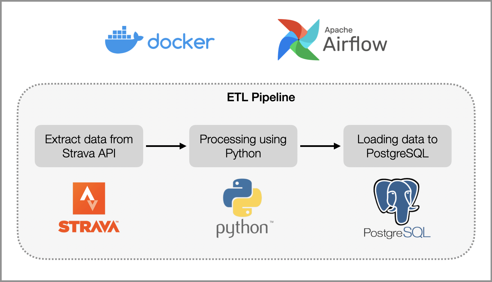

# Strava Data Pipline

This repository contains a pipeline to extract activity data from the Strava API, process it, and load it into a **PostgreSQL** database. The pipeline is scheduled to run once a week using **Apache Airflow**, which is managed and executed within **Docker** containers. This setup ensures that any new activity data is efficiently captured, processed, and stored for further analysis.



- **Data Extraction:** The data extraction step involves incrementally ingesting Strava activity data using the Strava API. The process begins by querying a `last_extracted` table in the PostgreSQL database to retrieve the timestamp of the last successful data extraction. Using the requests library, the pipeline then makes repeated calls to the Strava REST API to fetch all new activity data between the last date and the current date and time. To comply with Strava's rate limit of 100 requests per 15 minutes, the pipeline includes a time.sleep() command to pause between requests.

- **Data Tranformation:** In the data transformation step, the raw activity data is prepared for loading into the PostgreSQL activities table. The raw activity data is first validated to ensure accuracy, including checking that all IDs are unique and correctly matched. After validation, the data undergoes several transformations: geographic coordinates are converted to JSON format for easier handling, dates are formatted, and column names are updated to be more descriptive and consistent. These transformations make the data cleaner and better suited for storage and analysis.

- **Data Load:** In the data load step, the transformed activity data is inserted into the PostgreSQL `activities` table. This process starts by connecting to the PostgreSQL database and executing an SQL INSERT statement to insert the cleaned and formatted data. Additionally, the current date is recorded in the `last_extracted` table to mark the completion of the latest data extraction. This update helps track the most recent successful extraction and ensures that future extractions only retrieve new data since this timestamp.

## Installation

1. **Clone the repository**:

   ```bash
   git clone https://github.com/joanabaiao/strava-data-pipeline.git
   cd strava-data-pipeline
   ```

2. **Create configuration files**:

   - Obtain your Strava API access tokens by creating an application on the [Strava Developers website](https://developers.strava.com/).
   - Create a configuration file `config/config.yaml` with your Strava client ID, client secret, and access token. Include in this file your PostgreSQL setup:

     ```yaml
     strava:
       client_id: "xxxxxxx"
       client_secret: "xxxxxxx"
       refresh_token: "xxxxxxx"
       base_url: "https://www.strava.com/api/v3/"
       auth_url: "https://www.strava.com/oauth/token"
       activities_url: "https://www.strava.com/api/v3/activities"

     postgresql:
       host: "localhost"
       user: "xxxxxxx"
       password: "xxxxxxx"
       port: "5432"
       database: "xxxxxxx"
     ```

3. **Set up Docker and Docker Compose**:

   - Ensure Docker and Docker Compose are installed on your machine. Follow the official [Docker installation guide](https://docs.docker.com/get-docker/) for installation instructions.

4. **Docker Configuration**:
   - Update the `docker-compose.yml` file to configure environment variables and volume mounts for your Airflow setup.

## Usage

### Run Pipeline with Airflow and Docker

1. **Run Airflow in Docker**:

   - Follow the official [Running Airflow in Docker guide](https://airflow.apache.org/docs/apache-airflow/stable/howto/docker-compose/index.html).

   ```bash
   docker compose up airflow-init
   docker compose up
   ```

2. **Access the Airflow Web Interface**:

   - Open your web browser and navigate to `http://localhost:8080` to access the Airflow web interface.

3. **Trigger the DAG**:

   - From the Airflow web interface, you can manually trigger the `strava_pipeline_DAG` DAG and let it run according to the schedule defined in the DAG configuration.


### Run Pipeline Manually

To run the pipeline manually without using Airflow, execute the following command:

```bash
python main.py
```
